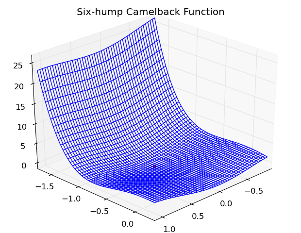

.. _tutorial:

Tutorial
========
    
Solving the six-hump camelback function
---------------------------------------

Filename: :file:`test/C6.py`

The following tutorial shows how to find the global minimum of a
`Six-hump camelback function` using the `DIRECT` algorithm.

.. math::

    f(x_1, x_2) = (4 - 2.1 x_1^2 + x_1^4 + x_1^4/3) x_1^2 + x_1 x_2 + (-4 + 4 x_2^2) x_2^2,
    
    \Omega = [-3, 3] \times [-2, 2].
    
First we need to import the ``solve`` function from the `DIRECT` package::

  >>> from DIRECT import solve

Then we need to define the objective of the function::

  >>> def obj(x, user_data):
    ...     """Six-hump camelback function"""
    ...     x1 = x[0]
    ...     x2 = x[1]
    ...     f = (4 - 2.1*(x1*x1) + (x1*x1*x1*x1)/3.0)*(x1*x1) + x1*x2 + (-4 + 4*(x2*x2))*(x2*x2)
    ...     return f, 0

We need to define the domain of the problem using block constraints::

  >>> l = [-3, -2]
  >>> u = [3, 2]

We use the `DIRECT` algorithm to solve the optimization problem.
The algoritm is called using the ``solve`` function. The `solve`
functions accepts the problem objective ``obj`` and block constraints::

  >>> x, fmin, ierror = solve(
    ...                 obj,
    ...                 l,
    ...                 u
    ...                 )

In the above we use the default settings of the `DIRECT` algorithm.
It us possible to costumize the algorithm using the paramters of
the ``solve`` function (see :py:func:`DIRECT.solve`).

The ``solve`` function returns the optimal point, ``x``, the optimal
objective, ``fmin``, and a status message ``ierror``.

We can visualize the problem using `matplotlib`::

  >>> fig = plt.figure()
  >>> ax = fig.add_subplot(111, projection='3d')

  >>> X, Y = np.mgrid[x[0]-1:x[0]+1:50j, x[1]-1:x[1]+1:50j]
  >>> Z = np.zeros_like(X)

  >>> for i in range(X.size):
    ...     Z.ravel()[i] = obj([X.flatten()[i], Y.flatten()[i]], None)[0]
        
  >>> ax.plot_wireframe(X, Y, Z, rstride=1, cstride=1, cmap=cm.jet)
  >>> ax.scatter(x[0], x[1], fmin, c='r', marker='o')
  >>> ax.set_title('Six-hump Camelback Function')
  >>> ax.view_init(30, 45)
  >>> plt.show()

This results in

More examples can be found in the source distribution under the
:file:`test/` folder.
